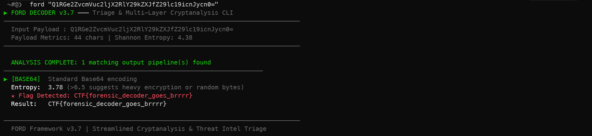
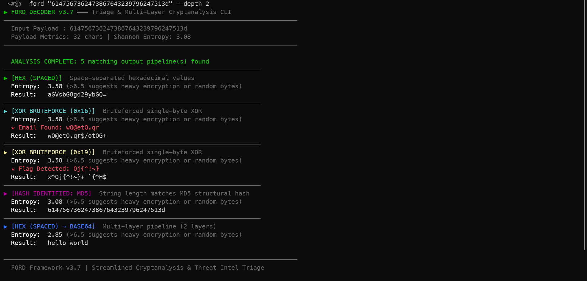

<div align="center">

<br/>


<br/>

> **Zero-dependency CLI for rapid encoding triage, multi-layer decoding, and IOC extraction.**  
> Drop a suspicious string in. FORD figures the rest out.

</div>

---

## Preview




---

## Features

| | |
|---|---|
| 🔍 **Auto-detect** | Base64, Base32, Base64-URL, Base85, Base58, Hex, Binary, ROT13/47, all 25 Caesar shifts, URL encode, HTML entities |
| 🔗 **Multi-layer chaining** | `--depth` recursively feeds decoded output back through all decoders |
| 💣 **XOR** | Static single-byte via `--xor`, or bruteforce 0x01–0xFF automatically |
| 🚩 **IOC extraction** | Auto-highlights CTF flags `WORD{...}`, IPv4, emails, and URLs |
| 🧬 **Hash identification** | MD5 / SHA-1 / SHA-224 / SHA-256 / SHA-384 / SHA-512 by digest length |
| 🗂️ **Magic bytes** | Detects PNG, JPEG, ZIP, RAR, ELF, PE, PDF, MP3 in binary output |
| 📊 **Shannon entropy** | Per-result entropy score to gauge encryption strength |
| 💾 **File output** | `--output` saves a clean ANSI-stripped report |
| 🪟 **Windows support** | VT100/ANSI auto-enabled, graceful fallback on legacy CMD |
| 🔁 **Stdin pipe** | `echo "..." \| ford` |

---

## Install

```bash
git clone https://github.com/DevanTQ/Ford.git
cd Ford
pip install -e .
```

`ford` is now available system-wide — no alias needed.

**With Base58 support (optional):**

```bash
pip install -e "[full]"
```

---

## Usage

```
ford "[encoded_text]"
ford "[encoded_text]" --depth 3
ford "[hex_string]"   --xor 0x42
ford "[encoded_text]" --output results.txt
echo "aGVsbG8=" | ford
```

### Flags

| Flag | Description |
|------|-------------|
| `--depth N` | Recursive decode depth, 1–5 (default: 1) |
| `--xor 0xKEY` | Single-byte XOR with given key |
| `--output FILE` | Save plain-text report to file |
| `--all` | Force-show all weak heuristic results |
| `--no-banner` | Suppress the header line |
| `-v / --version` | Print version and exit |

---

## Examples

```bash
# Basic Base64
ford "aGVsbG8gd29ybGQ="

# Nested encoding — Base64 wrapped in Hex, 2 layers deep
ford "6147567362473867643239796247513d" --depth 2

# XOR with known key
ford "2a3b1c4d" --xor 0x42

# XOR bruteforce — no key needed
ford "08040b0b0e"

# Pipe from stdin
echo "68656c6c6f" | ford

# Save report to file
ford "dGVzdA==" --output report.txt

# Show all results including weak matches
ford "aGVsbG8=" --all
```

---

## Requirements

- Python 3.8+
- No mandatory third-party packages
- Optional: `base58` · `colorama` (legacy Windows CMD)

---

## Project Structure

```
Ford/
├── ford.py            ← main tool
├── pyproject.toml     ← build config & CLI entrypoint
├── requirements.txt   ← optional dependencies
├── LICENSE
├── README.md
└── tests/
    └── test_ford.py   ← 35 unit tests
```

---

## Running Tests

```bash
pip install pytest
python -m pytest tests/ -v
```

---

## License

MIT — see [LICENSE](LICENSE)

---

<div align="center">
<sub>Built by <a href="https://github.com/DevanTQ">DevanTQ</a> · for CTF, DFIR, and anyone who stares at encoded strings too long</sub>
</div>
